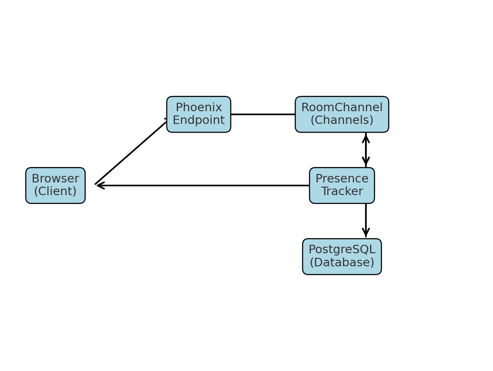

# ChatApp – Phoenix WebSocket Chat



A real-time chat application built with **Phoenix Framework 1.8** and **PostgreSQL**, inspired by Slack’s two-way messaging.  
It supports **multiple rooms**, **user presence tracking**, and **message history** using **Phoenix Channels** and **Presence**.

---

## **Features**

- **Real-time messaging** via Phoenix Channels (`room:*` topics).
- **Multiple chat rooms** – auto-created when first joined.
- **User presence tracking** – see who is online in the room.
- **Message persistence** – recent messages stored in PostgreSQL.
- **Simple, responsive UI** – minimal HTML/CSS + vanilla JS.
- **Extensible architecture** – ready for auth, file uploads, etc.

---

## **Tech Stack**

- **Backend:** Elixir, Phoenix Framework 1.8, Phoenix Channels, Phoenix Presence
- **Database:** PostgreSQL + Ecto
- **Frontend:** Vanilla JS, Phoenix JS Client, CSS
- **Communication:** WebSockets
- **Other:** Mix, npm, Vite (asset bundler)

---

## **Getting Started**

### **Prerequisites**
- Elixir >= 1.16
- Erlang/OTP >= 26
- Node.js >= 18
- PostgreSQL >= 13

---

### **1. Clone the repository**
```bash
git clone https://github.com/yourusername/chat_app.git
cd chat_app
```

---

### **2. Install dependencies**
```bash
mix deps.get
cd assets && npm install && cd ..
```

---

### **3. Configure the database**
Edit `config/dev.exs`:
```elixir
config :chat_app, ChatApp.Repo,
  username: "postgres",
  password: "postgres",
  hostname: "localhost",
  database: "chat_app_dev",
  pool_size: 10,
  stacktrace: true,
  show_sensitive_data_on_connection_error: true
```

---

### **4. Create and migrate the database**
```bash
mix ecto.create
mix ecto.migrate
```

---

### **5. (Optional) Seed initial data**
```bash
mix run priv/repo/seeds.exs
```

---

### **6. Start the server**
```bash
mix phx.server
```
Visit: **[http://localhost:4000](http://localhost:4000)**

---

## **Usage**

1. Enter a **username** and a **room name** (e.g., `lobby`).
2. Start chatting! Messages appear instantly across all connected clients.
3. Presence list updates in real time as users join or leave.

---

## **Project Structure**
```
lib/chat_app/          # Contexts and database logic
lib/chat_app_web/      # Web layer (controllers, channels, views, presence)
assets/                # Frontend JS, CSS, and bundler config
priv/repo/migrations/  # Database schema definitions
priv/repo/seeds.exs    # Optional initial data
```

---

## **Key Files**

- **lib/chat_app_web/channels/room_channel.ex** – main WebSocket logic.
- **lib/chat_app_web/presence.ex** – handles user tracking in rooms.
- **lib/chat_app/chat.ex** – room and message persistence.
- **assets/js/socket.js** – frontend WebSocket connection and events.

---

## **Extending the App**

You can enhance this project with:
- **User authentication** (Pow, Guardian, or custom JWT)
- **Private rooms / direct messages**
- **File uploads**
- **Typing indicators**
- **Message reactions / threads**

---

## **License**
MIT License – free to use and modify.

---

## **Author**
Victor Manuel Suarez Torres - victorms@gmail.com.
